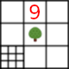

<!-- PROJECT SHIELDS -->
[![Contributors][contributors-shield]][contributors-url]
[![Forks][forks-shield]][forks-url]
[![Stargazers][stars-shield]][stars-url]
[![Issues][issues-shield]][issues-url]
[![MIT License][license-shield]][license-url]

<!-- PROJECT LOGO -->
<br />
<div style="text-align: center;">
  <a href="https://github.com/iehgit/nontree">
    
  </a>

<h3 style="text-align: center;">nontree</h3>

  <p style="text-align: center;">
    A python package for n-tree 2D data structures similar to and including quadtree, with mapping to payload data
    <br />
    <a href="https://pydocs.sedf.de/nontree"><strong>Explore the docs »</strong></a>
    <br />
    <br />
    <a href="https://github.com/iehgit/nontree/issues">Report Bug</a>
    ·
    <a href="https://github.com/iehgit/nontree/issues">Request Feature</a>
  </p>
</div>

<!-- TABLE OF CONTENTS -->
<details>
  <summary>Table of Contents</summary>
  <ol>
    <li>
      <a href="#about-the-project">About The Project</a>
    </li>
    <li>
      <a href="#getting-started">Getting Started</a>
      <ul>
        <li><a href="#prerequisites">Prerequisites</a></li>
        <li><a href="#installation">Installation</a></li>
      </ul>
    </li>
    <li><a href="#usage">Usage</a></li>
    <li><a href="#contributing">Contributing</a></li>
    <li><a href="#license">License</a></li>
    <li><a href="#contact">Contact</a></li>
  </ol>
</details>

<!-- ABOUT THE PROJECT -->
## About The Project

![Product Name Screen Shot][product-screenshot]

TODO
<!-- GETTING STARTED -->
## Getting Started

TODO

### Prerequisites

TODO

### Installation

TODO

   ```sh
   git clone https://github.com/iehgit/nontree.git
   ```

   ```sh
   TODO
   ```


<!-- USAGE EXAMPLES -->
## Usage

TODO

_For more details, please refer to the [Documentation](https://pydocs.sedf.de/nontree)._

<!-- CONTRIBUTING -->
## Contributing

Contributions are what make the open source community such an amazing place to learn, inspire, and create. Any contributions you make are **greatly appreciated**.

If you have a suggestion that would make this better, please fork the repo and create a pull request. You can also simply open an issue with the tag "enhancement".

1. Fork the Project
2. Create your Feature Branch (`git checkout -b feature/AmazingFeature`)
3. Commit your Changes (`git commit -m 'Add some AmazingFeature'`)
4. Push to the Branch (`git push origin feature/AmazingFeature`)
5. Open a Pull Request

<!-- LICENSE -->
## License

Distributed under the MIT License. See `LICENSE` for more information.

<!-- CONTACT -->
## Contact

Sebastian Dalfuß - [githubpublic@sedf.de](mailto:githubpublic@sedf.de)

Project Link: [https://github.com/iehgit/nontree](https://github.com/iehgit/nontree)

<!-- MARKDOWN LINKS & IMAGES -->
[contributors-shield]: https://img.shields.io/github/contributors/iehgit/nontree.svg?style=for-the-badge
[contributors-url]: https://github.com/iehgit/nontree/graphs/contributors
[forks-shield]: https://img.shields.io/github/forks/iehgit/nontree.svg?style=for-the-badge
[forks-url]: https://github.com/iehgit/nontree/network/members
[stars-shield]: https://img.shields.io/github/stars/iehgit/nontree.svg?style=for-the-badge
[stars-url]: https://github.com/iehgit/nontree/stargazers
[issues-shield]: https://img.shields.io/github/issues/iehgit/nontree.svg?style=for-the-badge
[issues-url]: https://github.com/iehgit/nontree/issues
[license-shield]: https://img.shields.io/github/license/iehgit/nontree.svg?style=for-the-badge
[license-url]: https://github.com/iehgit/nontree/blob/master/LICENSE
[product-screenshot]: README.images/myplot.png
